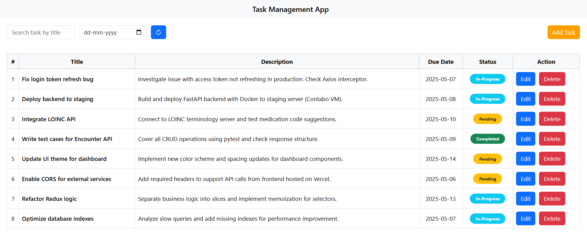

# Task Management App

Welcome to the **Task Management Web Application**!

### 🛠️ Technology Stack:

- React.js - for building the user interface
- Redux - for managing application state globally
- Redux Persist – to persist task data across page reloads
- Bootstrap – for responsive styling

### Screenshots

 <p align="center">
  
</p>

### 🚀 Getting Started

To run the Task Management App locally, follow these simple steps:

1. **Clone the repository** to your local machine:

   Open your terminal and run the following command:

   ```bash
   git clone https://github.com/anushree-more123/task-management-app.git
   ```

2. **Install the required npm packages:** Navigate into the project folder and install all dependencies:

   ```bash
   cd task-management-app
   npm install
   ```

3. **Start the application:** Once the installation is complete, start the app with:

   ```bash
   npm start
   ```

4. **Access the app:** The application will be running on localhost:3000. Open this URL in your browser to see it in action!

## 📄 Features

- **Task Creation:** Add tasks with descriptions and deadlines.
- **Task Management:** Update, delete, and mark tasks as completed.
- **State Management with Redux:** Efficiently handles the state of your tasks across the application.
- **Redux Persist Integration:** Your task list will remain intact even after refreshing or closing the browser.
